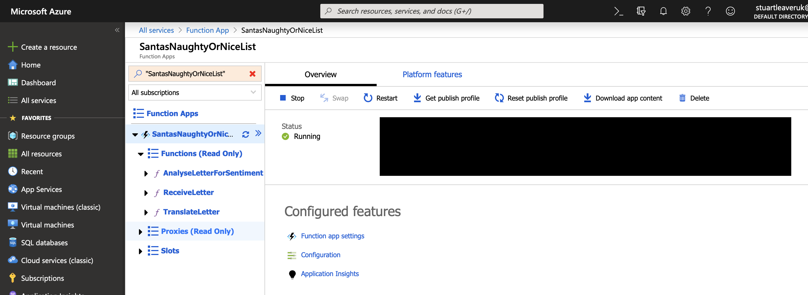
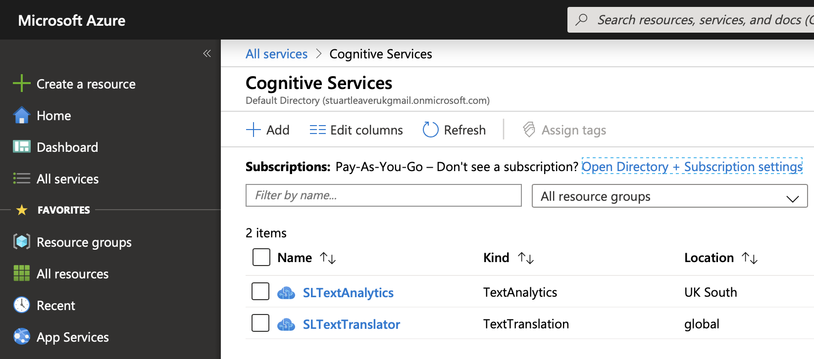
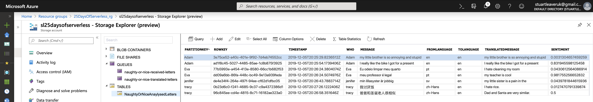

# Challenge 5: Smart Apps

## Solution

This was a fun one. **Azure Functions** to process the messages, **Azure Storage** for **Queues** and **Table** storage, **Azure Cognitive Services** to translate and process text for sentiment and an **App Service** to host an **MVC** frontend.

If you try out the code, remember to set the config values.

[The Working Demo Site](https://santanaughtyornice.azurewebsites.net) (Unless it starts costing me a lot of money!)

**Azure Functions**

**Azure Cognitive Services**

**Azure Storage**

**The List**

## Naughty or Nice

It's freezing cold up here on the North Pole, which normally makes it the ideal place to host a server farm. But today Santa's elves are freaking out!

Children all over the world write Santa letters to say what they want for Christmas. The elves had scripts running locally on the server farm to process the letters but without the missing servers this is no longer possible. Santa could translate manually, but he won't be able to get through all the letters in time!

Write a serverless application that helps Santa figure out if a given child is being naughty or nice based on what they've said. You'll likely need to detect the language of the correspondence, translate it, and then perform sentiment analysis to determine whether it's naughty or nice.

Have a look at the API https://aka.ms/holiday-wishes to find a sample of messages to validate whether your solution will work for Santa and his elves.

## Next Steps 🏃

Learn more about serverless with a Free Training!

-   ✅ **[Serverless Free Courses](https://docs.microsoft.com/learn/browse/?term=azure%20functions&WT.mc_id=25daysofserverless-github-cxa)**

## Important Resources ⭐️

Here include all the important features related to the challenges that are integrated into microsoft.docs. Ex.:

-   ✅ **[Azure Functions documentation](https://docs.microsoft.com/azure/azure-functions/?WT.mc_id=25daysofserverless-github-cxa)**
-   ✅ **[Azure SDK for JavaScript Documentation](https://docs.microsoft.com/azure/javascript/?WT.mc_id=25daysofserverless-github-cxa)**
-   ✅ **[Create your first function using Visual Studio Code](https://docs.microsoft.com/azure/azure-functions/functions-create-first-function-vs-code?WT.mc_id=25daysofserverless-github-cxa)**
-   ✅ **[Free E-Book - Azure Serverless Computing Cookbook, Second Edition](https://azure.microsoft.com/resources/azure-serverless-computing-cookbook/?WT.mc_id=25daysofserverless-github-cxa)**

## Questions? Comments? ❓

If you have any questions about the challenges, feel free to open an **[ISSUE HERE](https://github.com/microsoft/25-days-of-serverless/issues)**. We'll get back to you soon!
