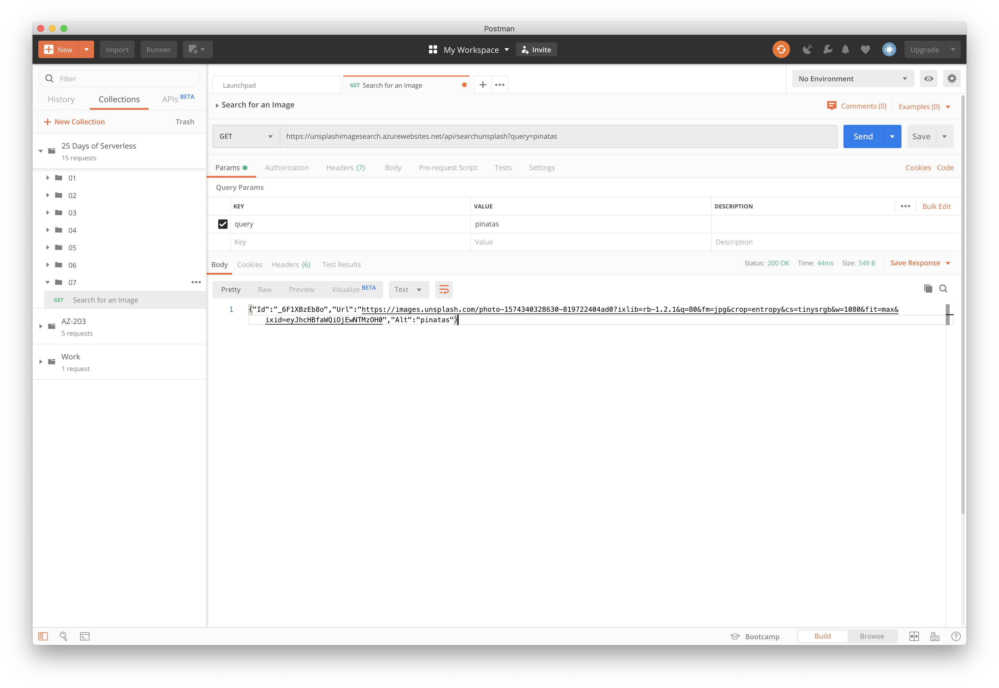

# Challenge 7: API Endpoint - Picture Challenge

## Solution

The problem calls for a web API that takes text as an input and returns an image found on **[UNSPLASH Picture API](https://unsplash.com/)** or another image platform.

1 - Having never used Unsplash before, I choose that option and signed up.

2 - To use the API, it was necessary to create an app to gain the required keys.

3 - Once I had the keys, I started about writing the function. While it would have been easy to use the Http client, I noticed that there was a [C# wrapper (Unofficial)](https://github.com/rootasjey/unsplasharp) available. So rather than reinventing the wheel, I made use of it.

4 - As above, the problem called for an image to be returned. However, it was noticed that if you used the same seach query, it always returned the same image. So the code was changed to return 10 images from Unsplash but to then pick a random image from those 10.

5 - The Api then returns a JSON string containing the Id, Url and alt description so that it could be used in a UI.

6 - The Azure Function was then deployed and can be tested (while I have the resource running in Azure) at https://unsplashimagesearch.azurewebsites.net/api/searchunsplash?query= adding your search word on at the end.

## The Problem

December 7 marks the first day of the official Christmas season in Guatemala. Everybody is scrambling to get ready for the big _la quema del diablo_ (burning of the devil) tonight — at 6pm sharp, everyone will start a bonfire to burn rubbish and items they don't need to cleanse their homes of evil.

Here in Guatemala City, our friend Miguel is concerned about the environmental impact! The past few years, people have been burning a lot of rubber and plastic that makes the air dirty. Some places are switching to burning paper piñatas of the devil, but Miguel still wants to let people metaphorically cleanse their houses of specific items they don't want.

Let's help Miguel by building a web API that lets his neighbors search for images of things they want to get rid of. Build an application (e.g. a cloud function with a single endpoint) that takes text as an input and returns an image found on unsplash or another image platform.
