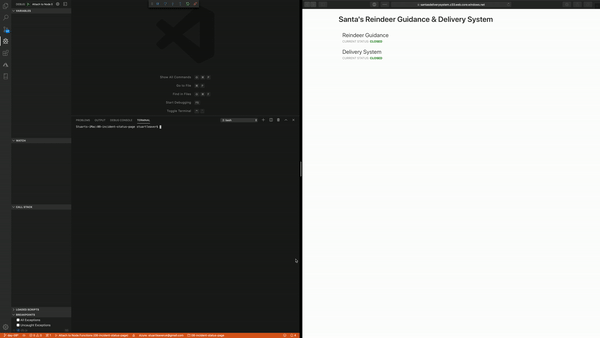

# Challenge 8: Build an Incident Status Page


## Solution

1. Created the required resources for the problem. These being a `Storage Account`, `SignalR Service` and a `CosmosDB`. [Microsoft Docs](https://docs.microsoft.com/learn/modules/automatic-update-of-a-webapp-using-azure-functions-and-signalr/?WT.mc_id=25daysofserverless-github-cxa) was very helpful

2. If using the code in this repo, create a `local.settings.json` with the following. Obviously putting in your own keys and connection strings:
```json
    {
      "IsEncrypted": false,
      "Values": {
        "AzureWebJobsStorage": "<AzureWebJobsStorage>",
        "FUNCTIONS_WORKER_RUNTIME": "node",
        "AzureSignalRConnectionString": "<AzureSignalRConnectionString>",
        "AzureCosmosDBMasterKey": "<AzureCosmosDBMasterKey>",
        "AzureCosmosDBConnectionString": "<AzureCosmosDBConnectionString>"
      },
      "Host" : {
        "LocalHttpPort": 7071,
        "CORS": "*"
      }
    }
```
3. Press `F5` and it should run and create sample data.
4. In a new bash window withing VS Code run `npm start` which will launch the UI.
4. To see the status changing, run `npm run update-data`



## The Problem

It's December 8th and Santa and his team are hard at work preparing for the big night, including replacing many of the servers and applications that run the reindeer guidance and delivery systems.

If something goes wrong with any part of that critical system, they need a way to report the status of disruptions to everyone involved in a successful Christmas morning.

They need a basic version of what you can find at [status.azure.com](https://status.azure.com).

During these tense disruptions, elves are actively diagnosing and working as quickly as possible to bring important systems back online. While response and remediation efforts are underway, it's important everyone who has a stake in the successful delivery of gifts stay "in the know".

We are tasked with building a method for Santa and his team to communicate the current status of service disruptions to a global audience. A "Status Page" solution.

## Challenge

Your challenge is to create a simple solution that helps inform elves and helpers all over the world when there is a problem with Santa's Reindeer Guidance & Delivery System - a "Status Page" to inform everyone what is known, what is being done, and when to expect additional information.
