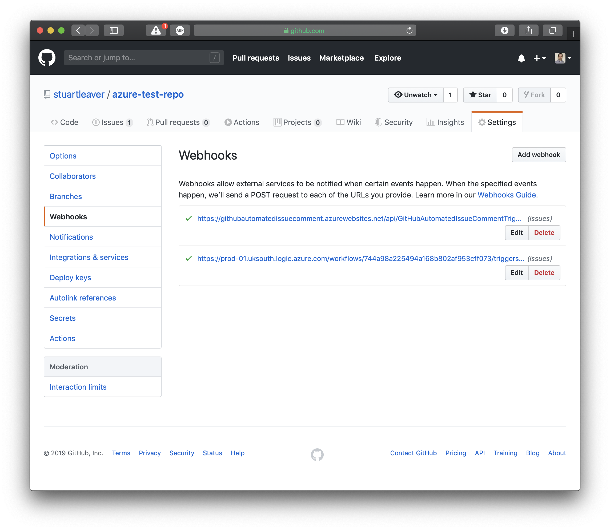
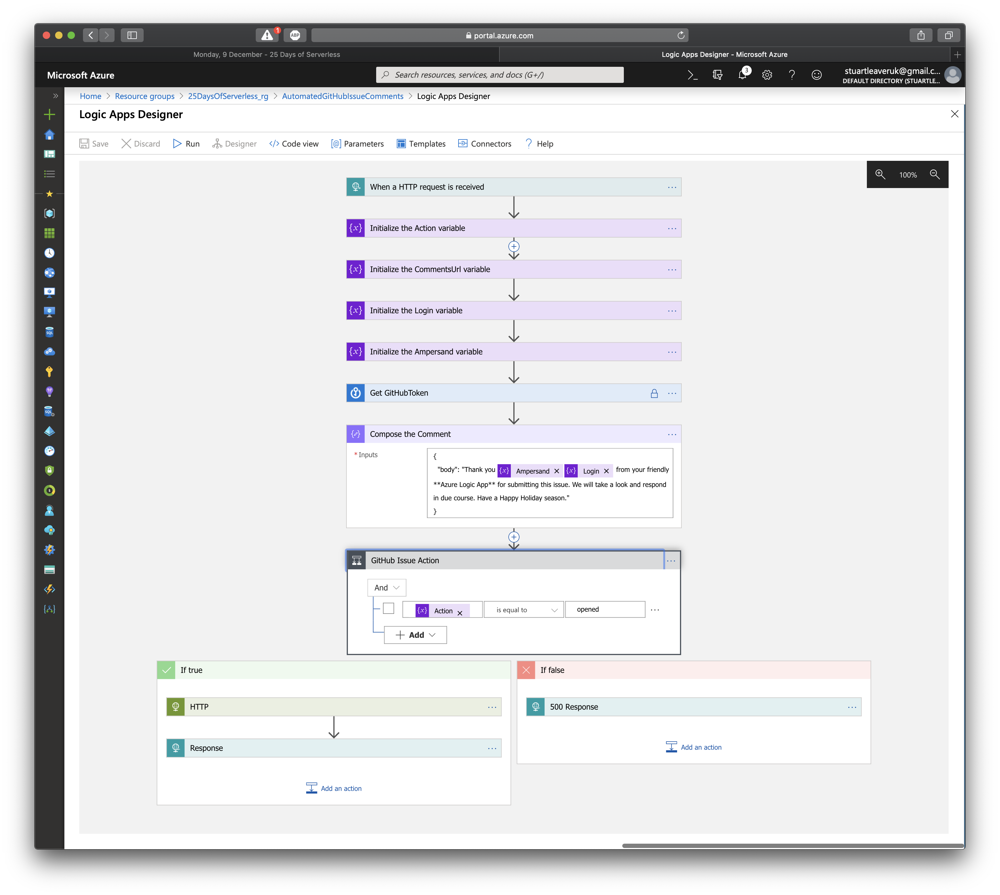
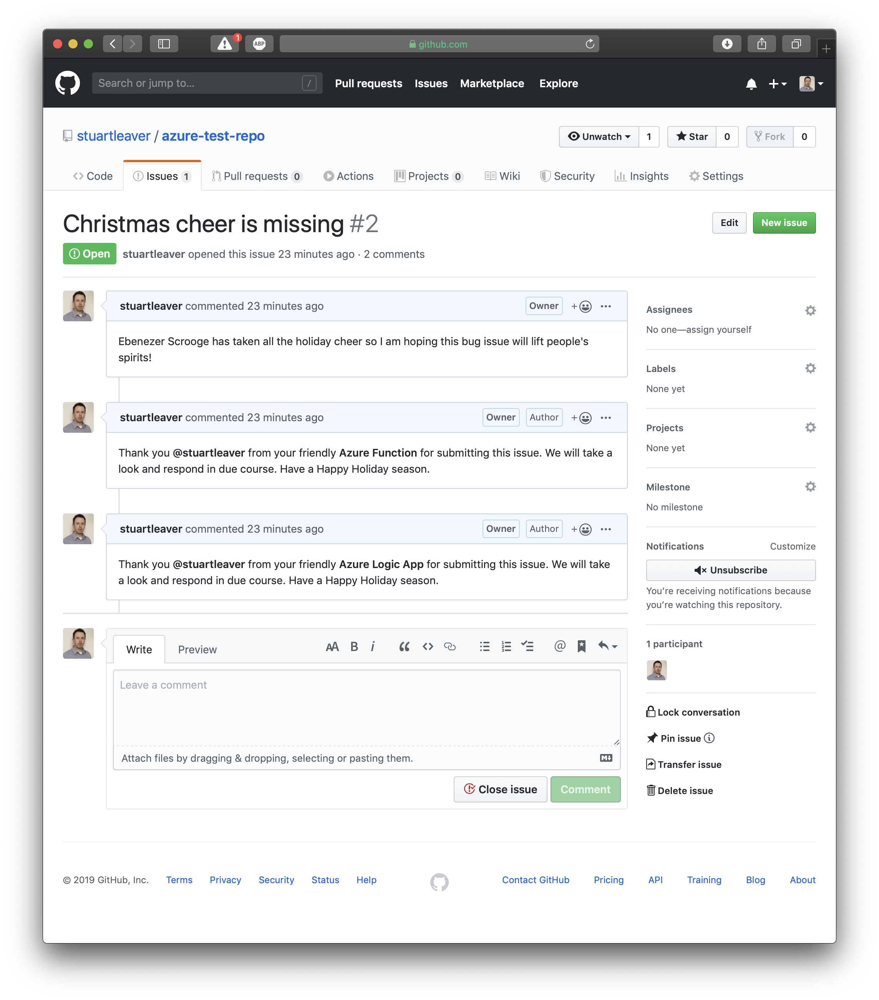

# Challenge 9: Automate Your GitHub Issues with Holiday Magic


## Solution

First, I solved the solution with an **Azure Function**. I then solved it again using a **Logic App**. So two solutions for the price of one. Both solutions make use of a **KeyVault** for the GitHub PAT token.

1. Create the required resources and deploy the code for the function and the ARM template can be used for the Logic App.

2. Create a PAT token in GitHub and make a (temporary) note of it - [Docs](https://help.github.com/en/github/authenticating-to-github/creating-a-personal-access-token-for-the-command-line?WT.mc_id=25daysofserverless-github-cxa_)

3. Create a KeyVault in Azure along with a secret for your PAT token:
```
az keyvault create --name "{KEY VAULT NAME}" --resource-group "{RESOURCE GROUP NAME}" --location {LOCATION}
az keyvault secret set --vault-name "{KEY VAULT NAME}" --name "GitHubToken" --value "{GITHUB PAT TOKEN}"
```

4. Configure the Identity in the Function resource and the allow the created AD user permissions in the KeyVault. Also make sure that the Logic App is happy accessing the Logic App.

5. Setup the Webhooks in the chosen GitHub repository and select the 'Issues' event.

6. Add a new application setting to the Function named `GITHUB_TOKEN_SECRET_KEY_VAULT_URL` with the URL to the GitHubToken secret in the KeyVault.

7. Create an issue and you should see two automated comments appear.





## Challenge

Bah humbug! Ebenezer Scrooge is miserable this holiday season. He never says thank you and this makes everyone sad, even Scrooge. Let's lift his spirits by saying thank you to everyone who contributes to his OSS projects on GitHub.

Do you feel good when someone says "thank you" when you contribute to a GitHub project? Let's use some holiday magic and serverless to automate this! After all, the holiday season is a time for smiling more and taking the time to say thank you to those around us.

We challenge you to automate creating a holiday themed "thank you" with serverless that replies to all issues created in one or more of your GitHub repositories


You can use any technologies you prefer to solve this challenge.

Show us what you can build and join our Days of Serverless, with Challenge 9.

Enjoy your challenge and Happy Holidays!
