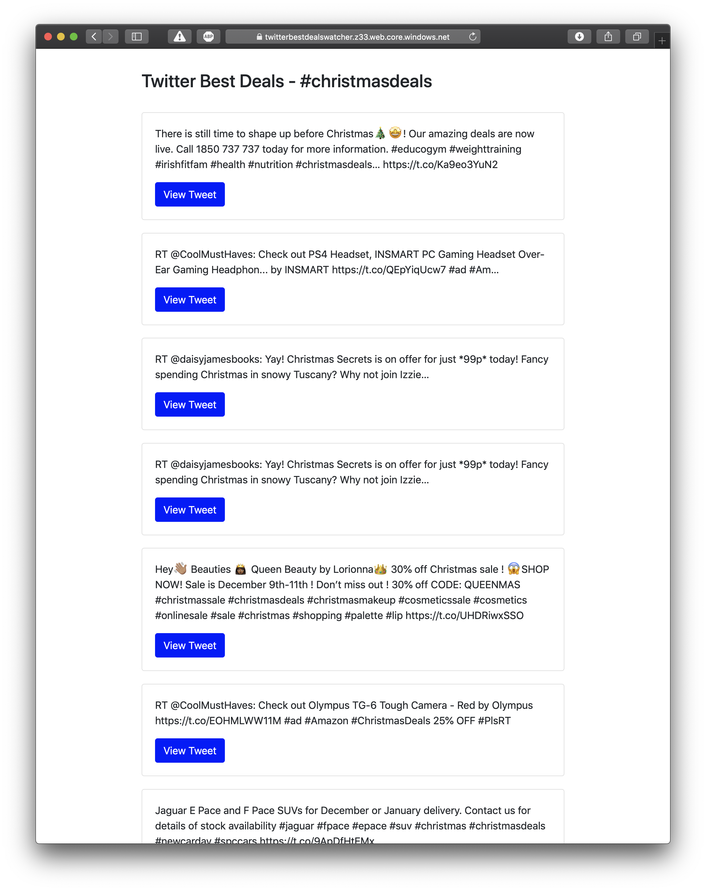

# Challenge 10: Timer Trigger


## Solution

**Logic App** to retrieve Tweet's using the [Twitter Connector for Logic Apps](https://docs.microsoft.com/en-us/azure/connectors/connectors-create-api-twitter?WT.mc_id=25daysofserverless-github-cxa) and store then in table storage and then an **Angular** frontend using an **Azure Function** as an API to display the Tweet's.

1. Deploy the resources as required. The Logic App does require connectors with login credentials so there maybe a bit of tweeking there.

2. In the `bestdeals.service.ts` file within the Angular code, set the URL of the Azure Function.

3. If running locally, you will need to add the following to the `local.settings.json` file:
```json
"Host": {
        "LocalHttpPort": 7071,
        "CORS": "*"
}
```

4. If running via [Static website hosting in Azure Storage](https://docs.microsoft.com/en-us/azure/storage/blobs/storage-blob-static-website?WT.mc_id=25daysofserverless-github-cxa), setup CORS in the Function App. To build the Angular frontend, use `ng build --prod`




## Daily Aggregated Deals

In Italy, children hang stockings on their fireplace so that an older woman named Befana can place their gifts inside of them. Along with the gifts, Befana also places candy or coal in each stocking based on how good they were that year.

This year has been really busy for Befana so she hired you as an assistant to help move things along faster. While Befana was shopping for candy, she lost her glasses. Her replacement glasses will arrive before the night of Epiphany, when children will be expecting their gifts. This is very unfortunate for Befana because she hasn't finished her gift shopping yet!

Befana is relying on you to finish shopping for the remaining gifts. Befana is really particular about getting a good deal on her shopping and expects you to be the same. Luckily, this is a major time of year for shoppers and deal seekers! But how do you keep track of all of these deals?Let's make a daily digest of current deals of interest!

In today's challenge, you'll create a tool that finds deals of the day from Twitter and adds them to a static web page. A Logic App is great serverless solution for this!
