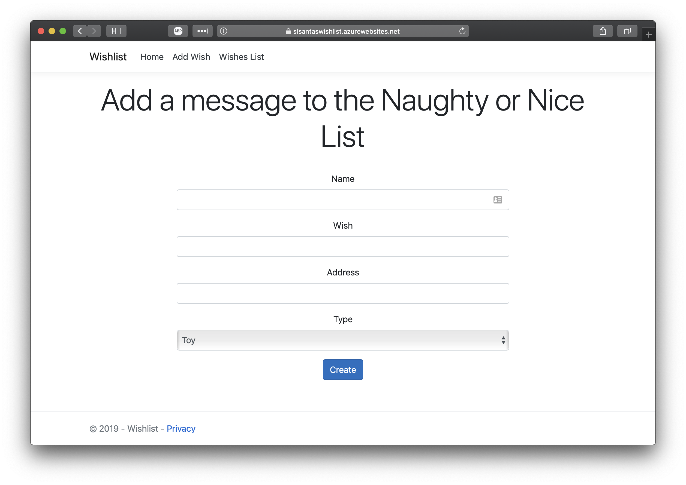
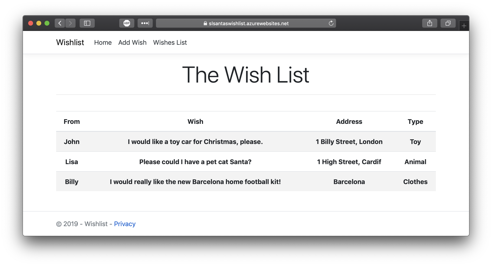
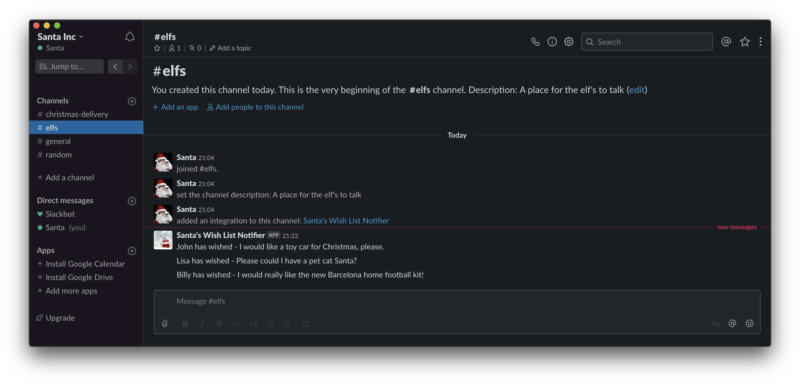

# Challenge 11: Database Trigger

## Solution

**App Service** hosting an MVC UI to allow the children to input their wishes and for Santa to view them. **Azure Functions** as API's and a **CosmosDB** to store it all. When a new document is placed in the **CosmosDB**, the **Change Feed** will trigger another **Azure Function** to post to Slack using a [webhook](https://slack.com/intl/en-pl/help/articles/115005265063-incoming-webhooks-for-slack).

1. Deploy, set the application keys and enable CORS. Nothing new from the previous tasks. Oh, and the Slack App for the webhook.

## Wishmaster 2000

It's that time of the year when all children start wishing for something amazing to end up in their stocking!

After last week's challenge, Santa's servers are completely overwhelmed with requests from children!

To help him handle the load, your challenge today is to build him a system that takes in childrens' requests and stores them for later processing. Additionally, he wants his elves to be notified every time a new gift wish arrives. If each new wish was published to something like Slack or Microsoft Teams, that would be super helpful in keeping his elves on top of all the requests!

Santa needs an endpoint that receives data in this format:
* a description of the wish
* who it's from
* address
* type of present (e.g toy, clothes, animal etc..)

Santa should be able to query that database on his own (he's a bit of a micromanager — this helps keep him off the elves' back!), as well as having a message get posted to Slack or another chat service whenever data is added to the database.

As a bonus challenge: kids would love a nice UI to input their wishes. Help them by building a webpage with a form that submits data in the previous format!
