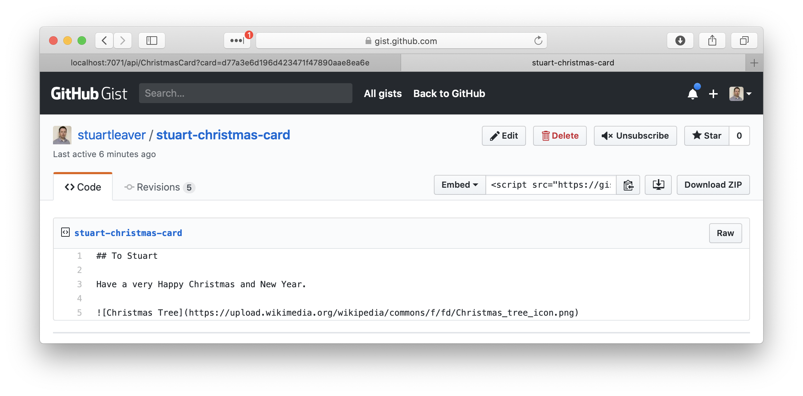
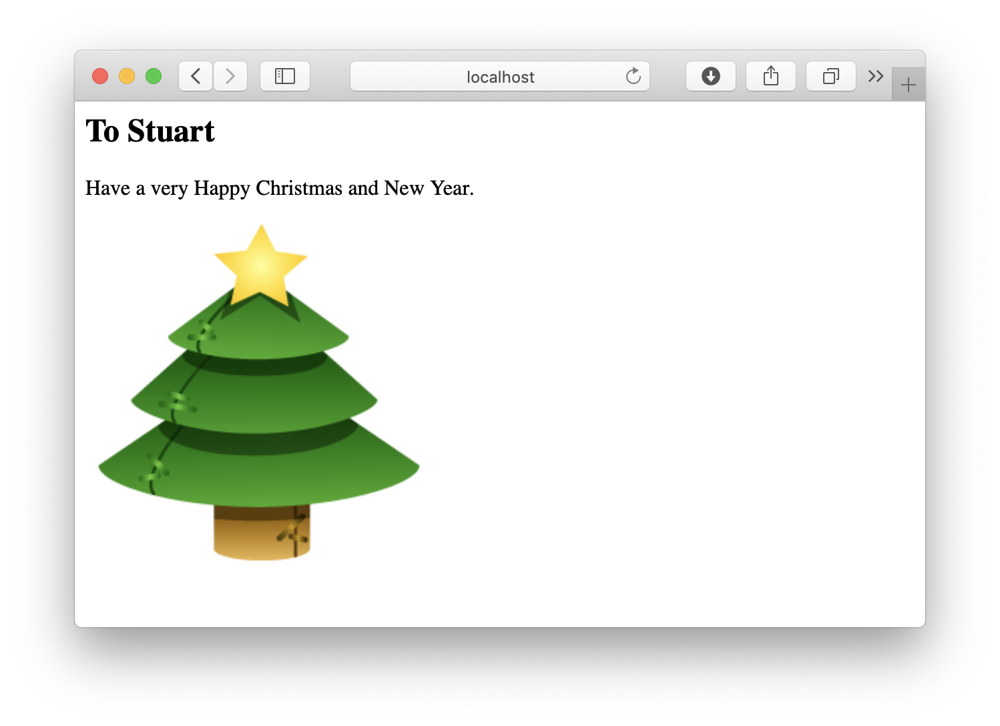

# Challenge 12: Caching

## Solution

**Redis Cache** to store the cached HTML after the Markdown has been created by an **Azure Function**. With the function using [Oktokit](https://github.com/octokit) to retrieve the Gist and [Markdig](https://github.com/lunet-io/markdig_) to convert the Markdown to HTML.

1. Create an Azure Redid Cache and place the connection string in the code with a key named `RedisConnectionString`

## The Challenge

Today in London, Simona wants to send beautiful holiday cards to all her friends But since she's worried they won't arrive in time, she doesn't want to hand-write and mail each individual letter!

Instead, she wants to make each of her friends a personalized website containing a holiday letter for them! She plans on writing each letter as its own Markdown file, and needs a way to turn those into websites.

Create a service that reads Markdown text from GitHub (perhaps using the Gist API), parses the Markdown to HTML, and returns the HTML to the client.

As a bonus challenge: reading and parsing Markdown is a lot of work! To optimize, cache your responses and send cached versions of the processed Markdown.
