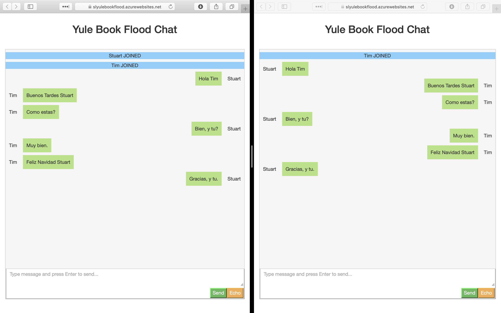

# Challenge 14: Stream Processing


## Solution

A simple web site that makes use of **SignalR** to display messages across all connected clients. This can be deployed to an App Service and so can auto scale when all of Joon's friends join.

1. Create an Azure SignalR resource and make a note of the connection string.

2. For local development, add the connection string to the secrets manager
```
dotnet user-secrets set Azure:SignalR:ConnectionString "<signal-r-connection-string>"
```

3. For deployment to an App Service, add an Application Setting named `Azure_SignalR_ConnectionString`



## The Challenge

It's that time of the year here in Reykjavík, Iceland: Jólabókaflóð!

For the "Yule Book Flood", instead of just giving gifts to each other, most Icelanders give each other books on Christmas Eve and then spend the evening reading!

Joon is too much of a social butterfly to read by himself all alone, though. While he and his friends are all sitting in their own homes reading, he wants to be able to talk to them about the various books they're enjoying!

Your challenge for today is to build Joon a real-time online chat service. It needs to be able to scale: if Joon's friends invite their friends, and they invite their friends, that could be a whole lot of people chatting about books! He and his friends should be able to log onto a web app where they can pick a username (and maybe even an avatar) and send chat messages that get sent in real-time to everyone else who's in the chat room.

Hint: you might want to look into Azure SignalR Service!
