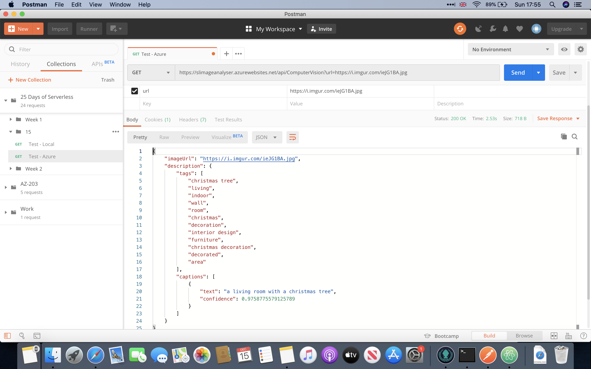

# Challenge 15: Cognitive Services with Computer Vision


## Solution

An **Azure Function** that will accept a URL of an image, and then using a Computer Vision resource, get the images description and tags.

For details, follow this great tutorial - [Computer Vision client library for .NET](https://docs.microsoft.com/en-us/azure/cognitive-services/computer-vision/quickstarts-sdk/csharp-sdk)

1. Create a Computer Vision resource in Azure and make a note of the key and endpoint.

2. Add the following keys:
```json
"COMPUTER_VISION_SUBSCRIPTION_KEY": "<COMPUTER_VISION_SUBSCRIPTION_KEY>",
"COMPUTER_VISION_ENDPOINT": "<COMPUTER_VISION_ENDPOINT>"
```



## The Challenge

Here in Munich, Germany, Felix is excited to go to a traditional Weihnachtsmarkt, a holiday market! He keeps texting photos to his friend Anna about all the fun things he's doing: drinking hot mulled Glühwein, going ice skating, shopping for presents. But Anna can't find her glasses, and can't clearly see what's in the pictures!

For today's challenge, Anna needs a service that, given an image, describe the image and gives some keywords about what it contains.
