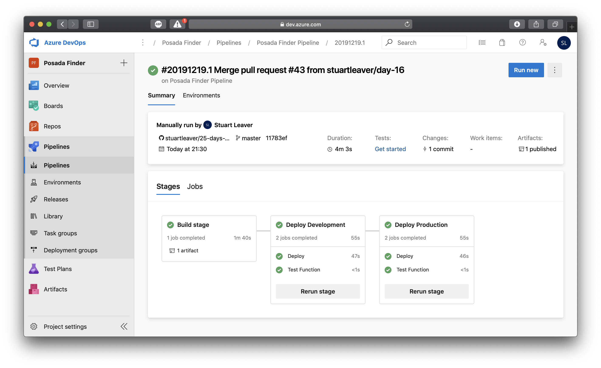
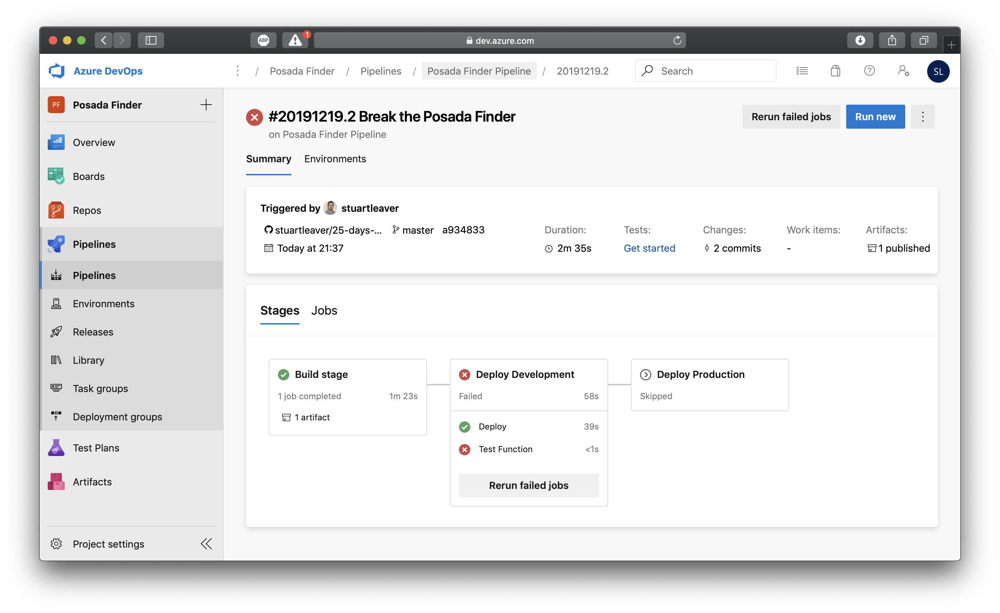
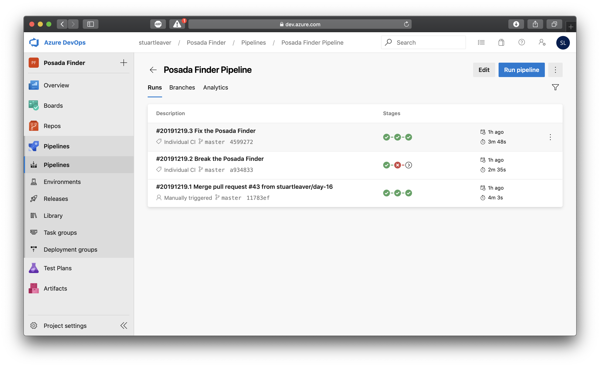
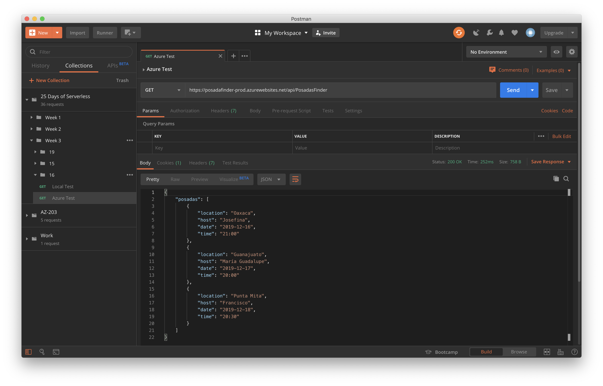

# Challenge 16: Continuous Integration and Continuous Delivery for Azure Functions

## Solution

The Posadas Finder is an **Azure Function** as an API which could be used within a frontend as well. This reads from a JSON file, `posadas.json`,  containing the list of Posadas. People can add to this list and via Pull Requests, merge the changes back into the master branch.

This will then trigger a CI/CD build which will, assuming all steps pass:
1. Build the Function.
2. Deploy to a 'development' environment.
3. Test the 'development' environment. Currently just for a 202 response for demo purposes but the tests could be made more specific.
4. Deploy to a 'production' environment.
5. Test the 'development' environment. Currently just for a 202 response for demo purposes but the tests could be made more specific.

Lets say that someone edits the JSON file and makes the syntax invalid. Step 3 above would fail and so the pipeline would stop and not deploy to 'production'. Thus keeping a work version available rather than having a breaking build.

1. The first build is run

2. Someone introduces a breaking changes

3. The build is fixed

4. API call

## The Challenge

We are only nine days away from Xmas... let the posadas begin!

It's the 16th of December, which can only mean one thing: Posadas are finally starting in Mexico! Everyone is already preparing for the following nine days of posadas and deciding on venues all across Mexico City for this festive tradition.

A couple of months back, Xanath offered to put together a list of hosts and locations so that all her friends and family had the details for each posada. With all the servers missing and so little time to collect the sites and inform everyone Xanath has asked some friends for help. They will all be working together to make a solution to help folks to find the location of the next posada.

Your challenge is to create a simple solution for Xanath's friends and family to find the locations of the upcoming posadas as well as the name of the person hosting. Since there will be several people working on the project and adding locations at the same time, you need to make sure that the solution is accordingly updated and deploy to reflect these changes.
