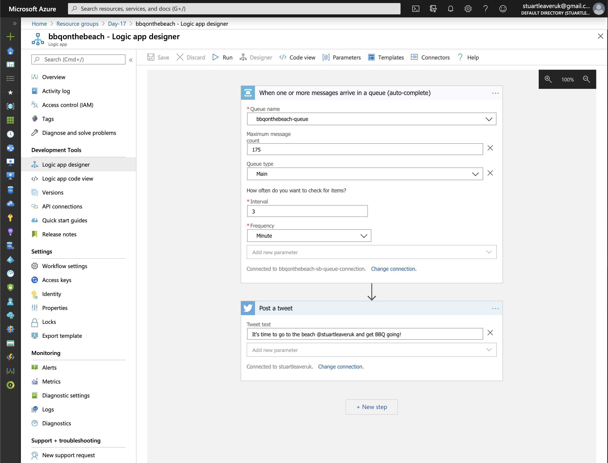

# Challenge 17: Azure IoT Hub

## Solution

An **Azure IoT Hub** routing messages to a **Logic App** via a **Service Bus** to Tweet when the temperature is right to go to the beech on Christmas Day. As a bonus, an **App Service** to also display the data. Rather than detailing everything here in terms of setup, here are some links:

* [Connect the Raspberry Pi simulator to Azure IoT Hub](https://docs.microsoft.com/en-us/azure/iot-hub/iot-hub-raspberry-pi-web-simulator-get-started)
* [IoT remote monitoring and notifications with Azure Logic Apps connecting your IoT hub and mailbox](https://docs.microsoft.com/en-us/azure/iot-hub/iot-hub-monitoring-notifications-with-azure-logic-apps)
* [Visualize real-time sensor data from your Azure IoT hub in a web application](https://docs.microsoft.com/en-us/azure/iot-hub/iot-hub-live-data-visualization-in-web-apps)

## The Challenge

Time for an Australian Christmas day BBQ on the beach

Skippy the Kangaroo and his mates, Kenny the Koala and Willy the Wombat, were very excited and looking forward to Christmas.

"Only a week to go!" said Kenny the Koala, "and I've been very good all year!"

Skippy and Willy looked at each other and rolled their eyes. "You haven't been THAT good," they thought. Skippy reminded his mates, "it’s not all about presents! My favourite part of Christmas is going to the beach, firing up the BBQ, having a nice cold beer, and relaxing with my friends and family. Let’s hope it's a sunny day!".

Your challenge is to build Skippy and his friends an Internet of Things system that helps let them know if it's a warm day at the beach. They want someting that can send them a tweet if it's currently warmer than 31°C (88° Fahrenheit) so they know whether or not to head all the way out to the beach for a truly Australian Christmas Day!

A tip: if you don't want to pull out a physical IoT device, you may want to use the Raspberry Pi Simulator to connect to the Azure IoT Hub.
