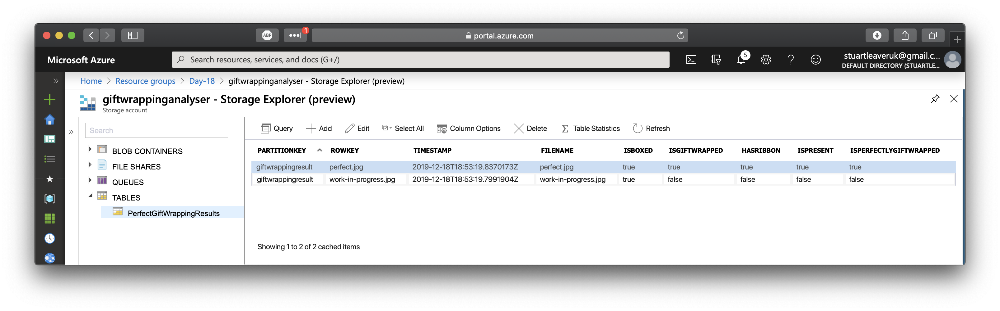

# Challenge 18: Wrapping the Perfect Gift

## Solution

An **Azure Function** with a blog trigger for when images are uploaded to a **Blob Container** in a **Storage Account**. The using ** Computer Vision** as part of **Azure's Cognitive Services**, analyse the image to detect certain tags. The result is then persisted to a **Table** within the same **Storage Account**.

## The Challenge

Santa's Elves are wrapping all of this year's gifts and they're looking for an automated way to confirm that each has been wrapped properly. According to Santa, each present must be wrapped according to the following rules:
1. Placed in a box
2. Box is wrapped
3. A bow / ribbon placed on top

Luckily Azure Cognitive Services offers an easy way to do this using the Computer Vision API!

Using Santa's example of a perfectly wrapped gift, the Computer Vision API confirms the following Tags:

[x] Box  
[x] Gift Wrapping  
[x] Ribbon  
[x] Present  
