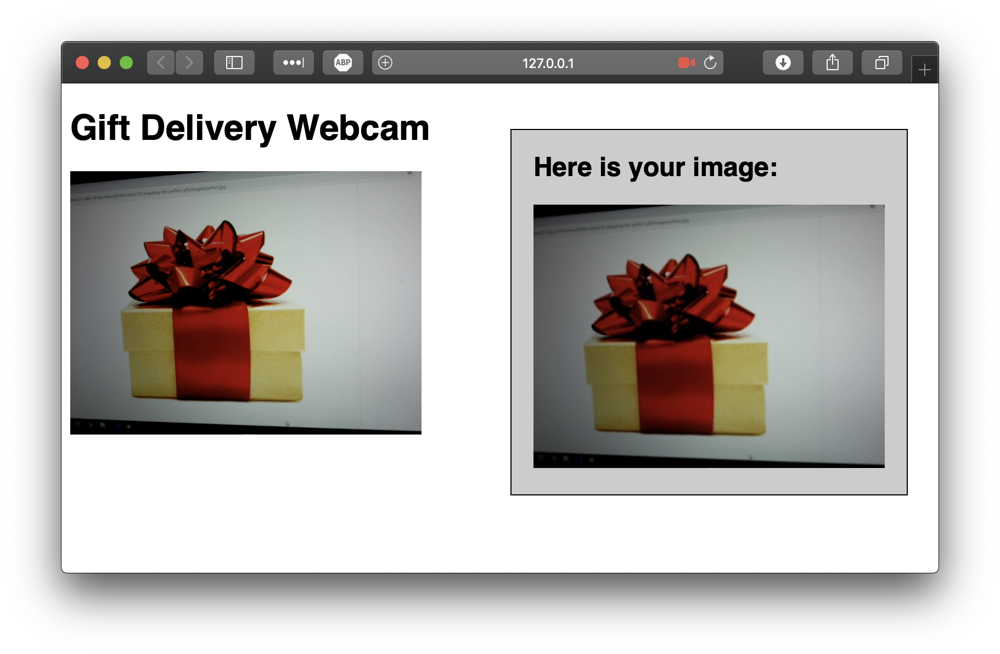

# Challenge 20: IoT with Cognitive Services

## Solution

Resources used:
* HTML5 Webcam
* Cognitive Services - Computer Vision
* Azure Function
* Notification Hub
* Xamarin Android Mobile App

The Webcam simulates a CCTV camera watching the front door. When a gift is detected through the use of an Azure Function and Computer Vision, a notification is sent via a Notification Hub to a mobile phone app.

Instructions on setting up the Notification Hub and app - [Tutorial: Send push notifications to Xamarin.Android apps using Notification Hubs](https://docs.microsoft.com/en-us/azure/notification-hubs/xamarin-notification-hubs-push-notifications-android-gcm)

Remember to setup all of the various configuration items.

## The Challenge

Holiday traditions vary so much from place to place. But one unifying theme is that, in so many places, the holidays are about giving and receiving presents! For example, in Catalonia and in the Marshall Islands, children prepare pinata-like figurines stuffed with small presents. So for today's challenge, let's answer together one of the biggest questions children (and adults) will have in a few days: have the presents been delivered yet?

Your challenge today is to build a system the children can use to let them know when their gifts have arrived! Build a serverless system that can detect when gifts are present, and then sends a notification to the recipient letting them know their gift has arrived.

There are many different way to do this! If you have an IoT device like a Raspberry Pi, there are all sorts of sensors you can use to detect the presence of gifts: proximity sensors, weight sensors, or laser beams like in Hollywood movies!

If you don't have any IoT hardware, you can use something else you'll have easily available: a camera! You can build a web app that uses the HTML5 camera API, or a native mobile phone app, to take in computer vision input, and then build an AI to detect if a picture has a present in it or not. There are a lot of ways to build systems like this; if you haven't done anything like this before, you may want to take inspiration from challenge 18.

However you detect the presence of presents, you also have a number of choices for alerting when gifts have been delivered. Depending on your choice of devices, you may want to explore different services: web socket, mobile push notifications, or something else! One particularly interesting approach might be to use an IoT architecture (with tools like Azure IoT Hub) to signal the event across any "edge" device.
