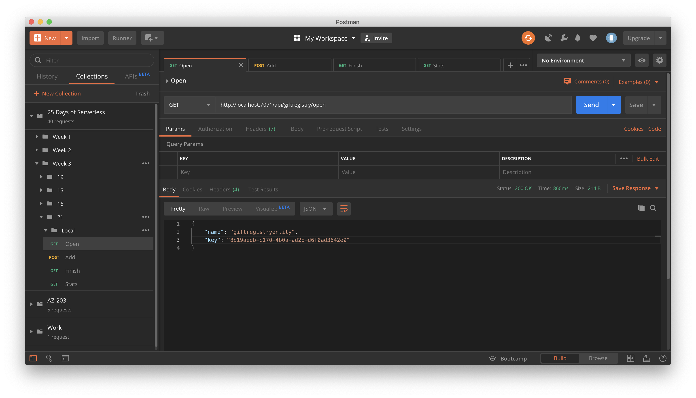
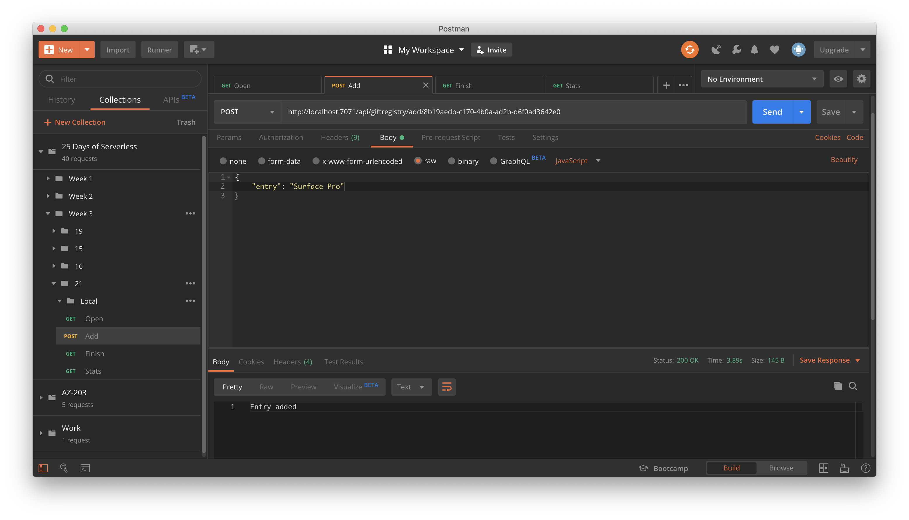
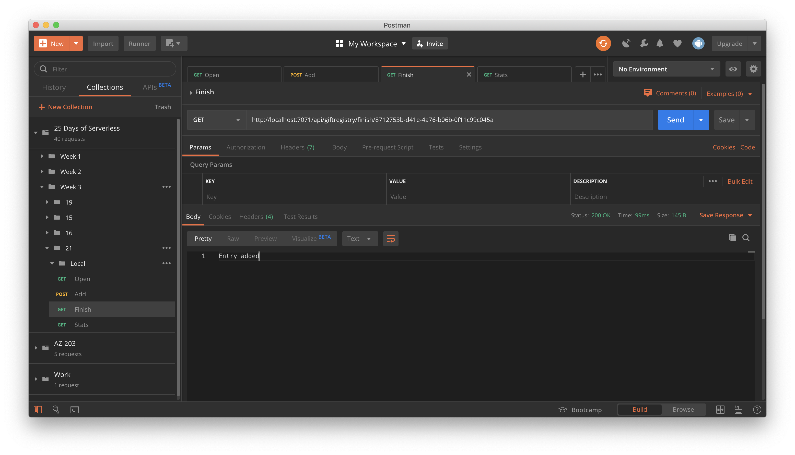
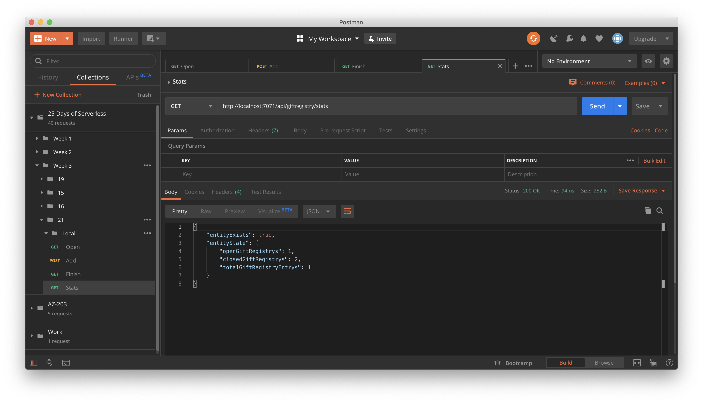

# Challenge 20: Serverless Workflows with Durable Functions

## Solution

**Azure Function** and **Durable Entities** with the operations as described in the challenge below.

* Open

* Add

* Finish

* Stats

## The Challenge

Last Minute Gift Registry

Oh no! The 🧝‍♀️🧝‍♂️ elves are upset. It's almost time to deliver gifts, but a glitch in the North Pole 💈 data center destroyed Santa's master registry list (should have backed it up to the cloud!). As a last minute effort to modernize North Pole operations, the lead developer elf decided to create a set of REST APIs to track gift registries. To create a sense of urgency and ensure the orders can be fulfilled, registries are only available for 5 minutes before they are automatically closed and sent for processing.

For this challenge, create a set of of WebHooks for managing registries. The WebHooks should support the following operations:
* Open to create a new registry and return a unique identifier for that registry
* Add to add an entry to the registry based on id (any text)
* Finish to close a registry based on id
* Stats to get the following stats: total registries (open or closed) and total items in the registry list (an aggregate across all registries)

If Finish is not called within 5 minutes after the registry is opened, it should automatically close regardless of whether any items have been added.

Bonus: Although not required for this challenge, it would be great to have a Peek WebHook to look at a registry and show if it is open or closed and what the contents are.
