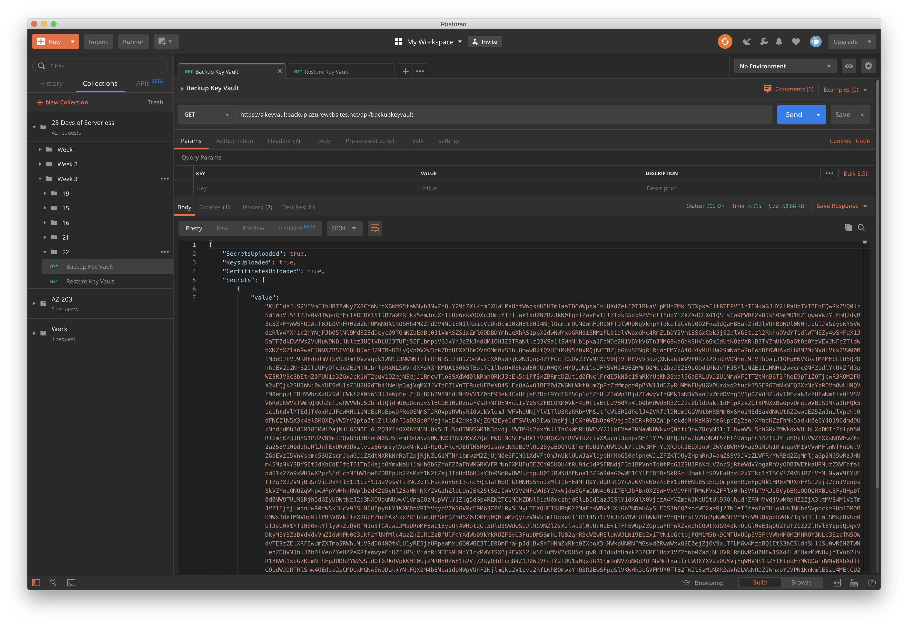
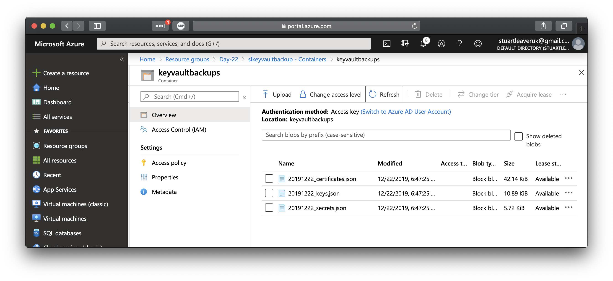
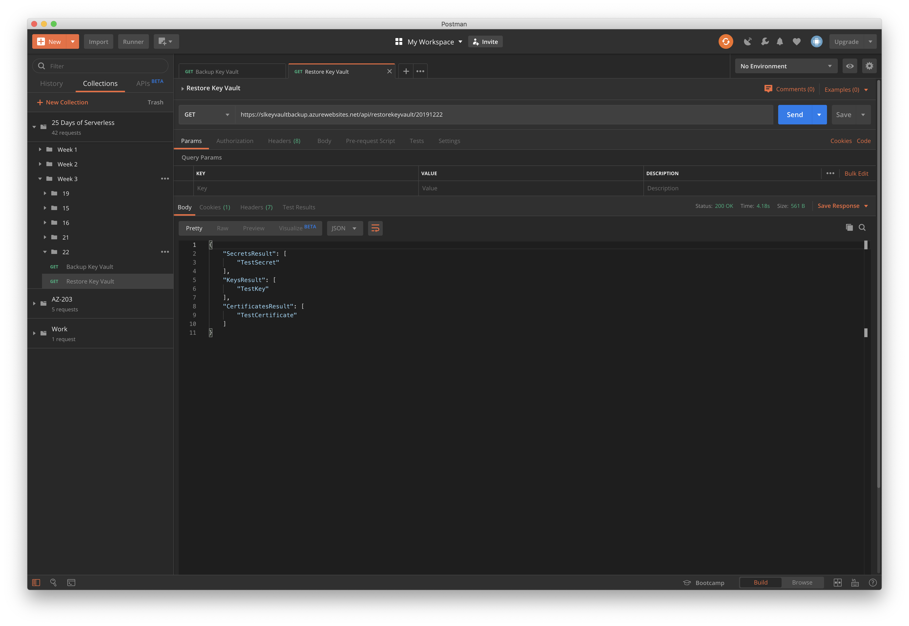

# Challenge 22: Winter Solstice - Protect Secrets From Grim Reaper

## Solution

**Azure Function** to backup keys, secrets and certificates within a **[Key Vault](https://docs.microsoft.com/en-gb/azure/key-vault/key-vault-overview?WT.mc_id=25daysofserverless-github-cxa)** to blob storage. Then another function to restore the files to a **Key Vault**

* Backup - `https://{key-valut-name}.azurewebsites.net/api/backupkeyvault`
* Restore - `https://{key-valut-name}.azurewebsites.net/api/restorekeyvault/{yyyyMMDD}`

Where `{yyyyMMDD}` corresponds to the file name of the backups.

Authentication for the Functions to access the Key Vault's is via [Managed Identity](https://docs.microsoft.com/en-gb/azure/app-service/overview-managed-identity?tabs=dotnet&WT.mc_id=25daysofserverless-github-cxa)

* Backup

* Blobs

* Restore

## The Challenge

Welcome to Korea in this festive season! Today is Winter Solstice, which means grim reapers are wandering around in search of young kids' souls to steal. But there's a way to keep the children safe: the reapers can't find any child who eats red-bean porridge before going to sleep!

Oh no! Cheol-soo missed the porridge tonight, and is in danger to get caught by the grim reaper! His best friend Young-hee locked him in a safe place until sunrise, and stored the digital key to the smart lock in Azure Key Vault.

The grim reaper is annoyed that they're thwarted, though, and is trying to destroy the Key Vault to trap Cheol-soo in the safe room! Young-hee needs to figure out how to back up and restore the Key Vault before the Grim Reaper destroys it, or else Cheol-soo will be stuck in there forever!

Build a system that can back up and restore a secure key vault. If you're using Azure Key Vault, you may want to investigate Blob Storage restoration via Managed Identity.
