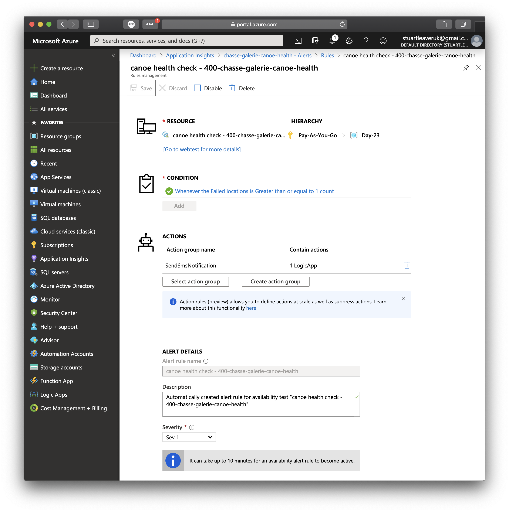
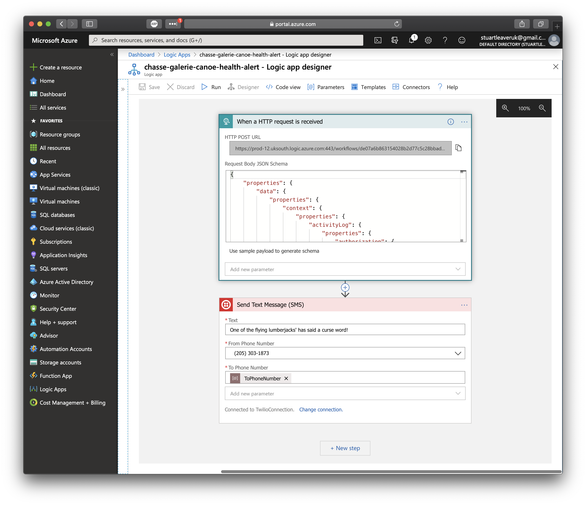

# Challenge 23: Instrumenting Functions

## Solution

**Azure Function** to simulate the flying lumberjacks cursing 10% of the time on their [Chasse-Galerie](https://en.wikipedia.org/wiki/Chasse-galerie). Return a 200 if things are OK, else a 400. **[Azure Application Insights](https://docs.microsoft.com/azure/azure-functions/functions-monitoring?WT.mc_id=25daysofserverless-github-cxa)** is then used to capture the events from the Function app. This is done through the use of Rules Management with an Action of triggering a **Logic App**. The **Logic App**, when triggered, sends an SMS text message waring of the flying Lumberjacks behaviour.
The Events are also displayed on a custom Dashboard.

* Rule

* Logic App

* SMS

* Dashboard

## The Challenge

Ages ago, workers of a remote timber camp in Quebec wanted to meet their wives for the night of Christmas. The problem was that they needed to work the next day and their homes were hundreds of leagues away. They made a pact with the devil to run the Chasse-Galerie so that their canoe could fly through the air.

A flying canoe would surely allow them to get home and back before the night was over! However, as part of the deal, the workers are not allowed to curse or their soul would be claimed by the devil.

On their trip to their home, and back, we need to make sure that their canoe is still operational. Their worried wives will be monitoring if everything is okay. They will need to receive an alert if something happens.

For this scenario, the canoe will need an Health Check endpoint that will return a 200 if everything is okay or throw an exception if a worker has cursed on their voyage. The worker curses 10% of the time.

After that endpoint is up and running, you'll need to build something that can notify the flying lumberjacks' wives if things have gone horribly wrong. One choice might be to use Azure Application Insights.
