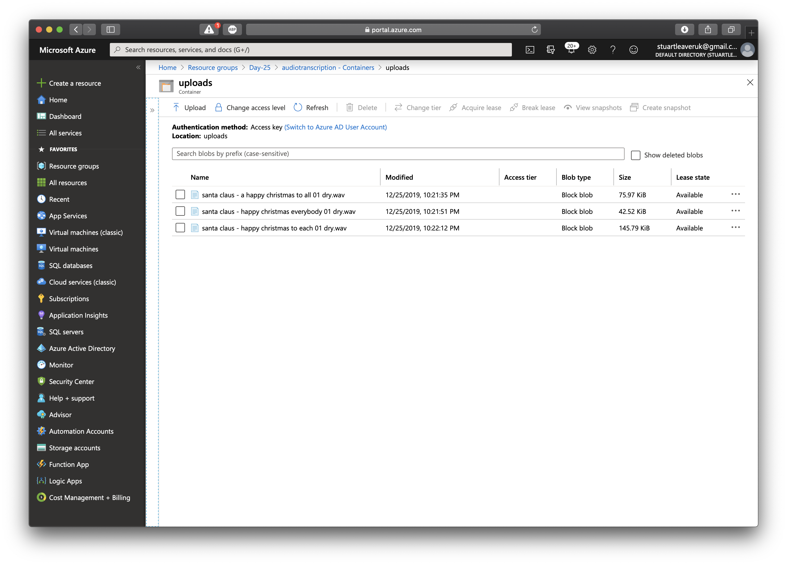
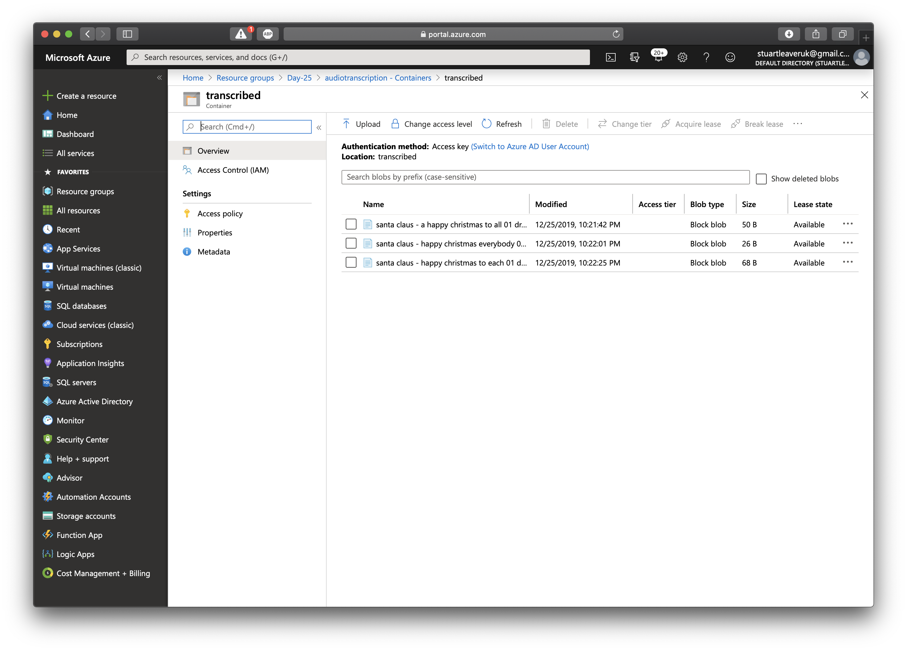
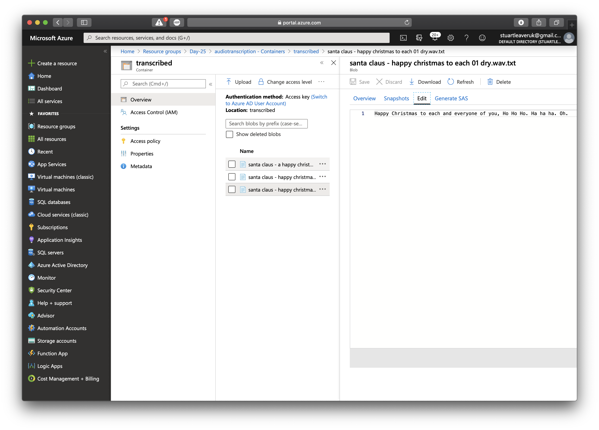

# Challenge 25: Audio Transcription


## Solution

**Azure Function** using **Speech to Text** as part of **Cognitive Services** to take uploaded WAV files and convert them to text. The uploaded files and resulting text files are stored in **Blob** storage. The function is trigger by a file being uploaded. Also, when a file has been processed, a SMS is also sent using the **Twilio** binding.

The following needs to be added to the `local.settings.json` file or the Azure Function settings in the Azure Portal:

```json
"SPEECH_SUBSCRIPTION_KEY": "{SPEECH_SUBSCRIPTION_KEY}",
"SPEECH_SERVICE_REGION": "{SPEECH_SERVICE_REGION}",
"TWILIO_ACCOUNT_SID": "{TWILIO_ACCOUNT_SID}",
"TWILIO_AUTH_TOKEN": "{TWILIO_AUTH_TOKEN}",
"TWILIO_FROM_NUMBER": "{TWILIO_FROM_NUMBER}",
"TWILIO_TO_NUMBER": "{TWILIO_TO_NUMBER}"
```

* Uploaded files

* Transcribed files

* Transcribed text

* Texts


## The Challenge

India is home to multiple religions and cultures, with everyone celebrating "Bada Din" (the big day) with flowers (poinsettias), lights (paper lanterns) and, most importantly, a family feast! The center of attraction is kheer, the traditional rice pudding with nuts, spices, milk and sugar.

Aarti is particularly excited this year because her entire family is coming over to her new place to celebrate with her. But she needs a good kheer recipe. And the best ones come from ajjis (grandmas) - but they don't like tech and prefer to just talk on the phone. How can she find the right recipe in time? Aarti's friends are on the case: we'll just record our grandmas telling us her recipe they say!

For today's challenge, help Aarti out by setting up the Bada Din Kheer Hotline! Make a service where her friends can upload recordings, that are then automatically converted into text transcripts and stored somewhere on the cloud for Aarti to quickly scan for ideas. Azure Functions, Cognitive Services, and Azure Storage might be helpful to you!

If you're feeling particularly eager, there are a few ways you can make things even easier for Aarti:
* Stretch goal 1: Using a Twilio integration, alert Aarti whenever a friend uploads a new recipe
* Stretch goal 2: Integrate translations, so her friends' ajjis can provide recipes in any language
* Stretch goal 3: Build a web app that publishes the transcribed recipes as a nicely-formatted website
